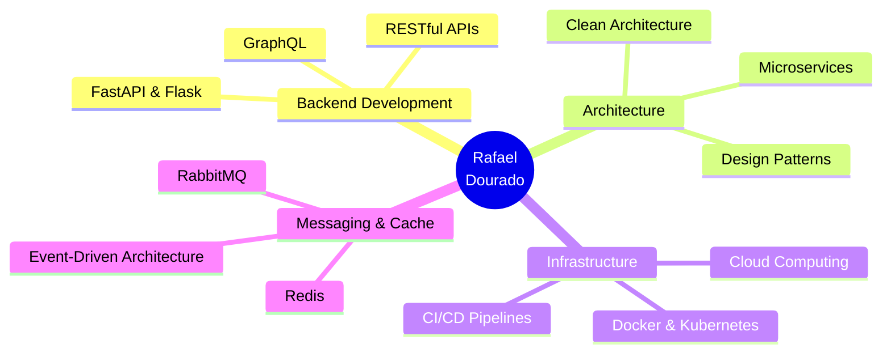

<div align="center">

# 🚀 Rafael Dourado

### Backend Developer | Software Engineer | Python Specialist


[](https://www.linkedin.com/in/rafael-dourado-dev/)
[](mailto:rafaeldouradoc7@gmail.com)
[](https://github.com/rafaeldourado8)


</div>

---

## 👨‍💻 Sobre Mim

```python
class RafaelDourado:
    def __init__(self):
        self.name = "Rafael Dourado"
        self.role = "Backend Developer"
        self.age = 23
        self.location = "Mato Grosso do Sul, Brasil 🇧🇷"
        self.education = "Engenharia de Software - Faculdade Estácio"
        self.languages = ["Python", "Java", "C"]
        self.email = "rafaeldouradoc7@gmail.com"
        
    def get_current_focus(self):
        return [
            "Microservices Architecture",
            "Clean Architecture & Design Patterns",
            "High Performance APIs",
            "DevOps & Cloud Infrastructure",
            "Distributed Systems"
        ]
    
    def say_hi(self):
        print("Obrigado pela visita! Vamos construir algo incrível juntos!")

me = RafaelDourado()
me.say_hi()
```

<div align="center">

### 💼 O Que Eu Faço

> Desenvolvo soluções backend **escaláveis**, **seguras** e **performáticas** utilizando Python e arquiteturas modernas baseadas em microsserviços.

</div>

---

## 🛠️ Tech Stack

<div align="center">

### 🐍 Backend & Core


### 🗄️ Databases & Cache


### ☁️ DevOps & Infrastructure


### 🔧 Other Technologies


</div>

---

## 📊 GitHub Analytics

<div align="center">
  
  
</div>

<div align="center">
  
</div>

<div align="center">
  
</div>

---

## 🏆 GitHub Trophies

<div align="center">
  
</div>

---

## 🎯 Áreas de Interesse

<div align="center">



</div>

---

## 💡 Filosofia de Desenvolvimento

<div align="center">

> ### "Code is like humor. When you have to explain it, it's bad."
> 
> Acredito em código limpo, testes automatizados e documentação clara.
> 
> Sempre buscando **performance**, **escalabilidade** e **manutenibilidade**.

</div>

---

## 📈 Atividade no GitHub

<div align="center">


</div>

<div align="center">
  
  
</div>

---

## 📫 Vamos Conversar?

<div align="center">

Estou sempre aberto a novos desafios e colaborações!

[](https://www.linkedin.com/in/rafael-dourado-dev/)
[](mailto:rafaeldouradoc7@gmail.com)
[](https://github.com/rafaeldourado8)


</div>

---

<div align="center">
  <sub>✨ Construído com ☕ por Rafael Dourado</sub>
</div>
